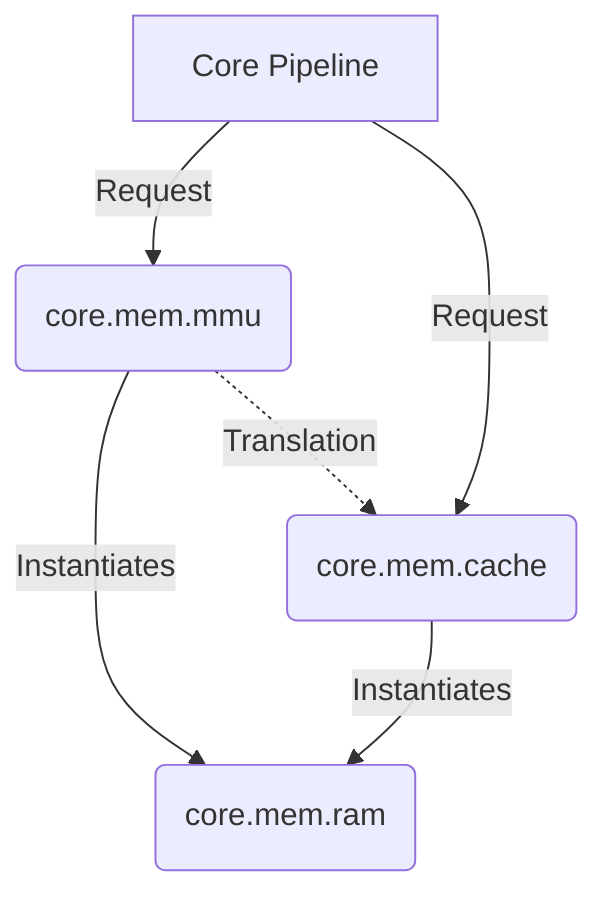

# 📚 Package: `core.mem` (Memory Subsystem)

> **The Library of MarCore**
> **MarCore 存储子系统架构文档**

## 1. 概览 (Overview)

`core.mem` 包负责管理处理器中所有与 **数据存储 (Storage)**、**数据访问 (Access)** 以及 **地址管理 (Address Management)** 相关的逻辑。

它是处理器的“后勤总管”。不同于 `core.backend` (负责计算与执行) 和 `core.frontend` (负责取指与译码)，`core.mem` 的核心职责是 **为流水线提供准确的数据和指令服务**。

## 2. 目录结构 (Directory Structure)

我们采用了 **“物理设施 - 访问逻辑 - 地址管理”** 三层分离的架构模式：

```text
src/main/scala/core/mem/
├── ram/                <-- [基础设施层] (Infrastructure Layer)
│   ├── SRAMWrapper.scala   # 具体的 SRAM 宏封装 (extends MarCoreModule)
│   └── MemConfig.scala     # 存储阵列的物理参数配置
│
├── cache/              <-- [数据管理层] (Data Management Layer)
│   ├── ICache.scala        # 指令缓存逻辑
│   ├── DCache.scala        # 数据缓存逻辑 (含一致性、Write buffer等)
│   └── Metadata.scala      # Tag, Valid, Dirty 等元数据结构
│
└── mmu/                <-- [地址翻译层] (Address Translation Layer)
    ├── TLB.scala           # Translation Lookaside Buffer (含复杂查找/替换逻辑)
    ├── PTW.scala           # Page Table Walker (页表漫游状态机)
    └── PMP.scala           # Physical Memory Protection (物理内存保护)
```

## 3. 子包定义与职责 (Sub-package Definitions)

### 3.1 `core.mem.ram` (The Bricks / 砖块)

* **定位**：物理原语层 (Physical Primitives)。
* **职责**：提供 **通用的、与逻辑无关的** 存储阵列接口。它是构建 Cache, TLB, 甚至 BPU (Branch Prediction Unit) 的基础材料。
* **设计原则**：
  * **纯粹性**：只管存取 bit，不懂什么是 Cache Line，也不懂什么是页表。
  * **可移植性**：所有的 Foundry/Technology 相关宏定义 (Macro) 均隔离在此处。
  * **复用性**：虽然位于 `mem` 包下，但作为基础组件，允许被 Core 的其他子系统（如 `core.branch`）引用。

### 3.2 `core.mem.cache` (The Warehouse / 仓库)

* **定位**：高速缓存逻辑层。
* **职责**：利用 `ram` 构建的物理阵列，实现复杂的缓存管理策略（Set-Associative, LRU/PLRU, Write-Back/Write-Through）。
* **设计原则**：
  * **策略封装**：Cache 控制器负责处理 CPU 流水线的请求，向 CPU 隐藏底层的 RAM 时序。

### 3.3 `core.mem.mmu` (The Librarian / 图书管理员)

* **定位**：地址管理单元 (Memory Management Unit)。
* **职责**：负责虚拟地址 (VA) 到物理地址 (PA) 的翻译、权限检查和页表维护。包含 TLB 和 PTW。
* **设计原则**：
  * **为何在此？**：尽管 TLB 包含极高密度的控制逻辑（CAM 匹配、状态机），但其核心职能是 **服务于内存访问**。它是存储子系统的“检索系统”。
  * **紧耦合**：MMU 与 Cache 物理距离极近（VIPT/PIPT 索引需求），归属同一子系统有助于接口协同。

## 4. 设计哲学 (Design Principles)

### 4.1 逻辑与材料分离 (Separation of Logic and Material)

我们拒绝将 SRAM 的物理定义硬编码在 Cache 或 TLB 代码中。

* **`ram`** 定义了“能不能存”。
* **`cache/mmu`** 定义了“怎么存”和“存哪里”。

这种分离使得未来更换工艺库（例如从 TSMC 28nm 换到 SMIC 14nm）时，只需修改 `core.mem.ram`，而无需触碰复杂的 Cache/TLB 逻辑。

### 4.2 服务导向架构 (Service-Oriented)

`core.mem` 向处理器的其他部分提供标准服务：

* 向 **Frontend** 提供指令流 (Instruction Stream)。
* 向 **Backend** (LSU) 提供数据读写 (Load/Store)。
* 向 **System** 提供地址空间管理 (Translation)。

所有跨子系统的交互应遵循 `core.uarch.interfaces` 中定义的标准总线协议，保持模块间的低耦合。

## 5. 依赖关系 (Dependency Graph)


